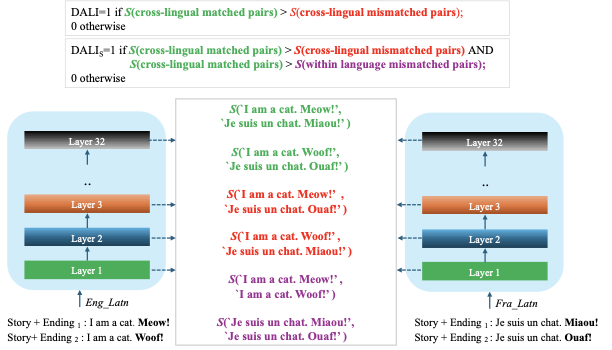

# Can you map it to English? The Role of Cross-Lingual Alignment in Multilingual Performance of LLMs

This repository contains code for investigating cross-lingual alignment with English in large language models (LLMs) through activation patching experiments on multilingual multiple-choice question answering (MCQA) benchmarks.

## Overview

We analyze the role of cross-lingual representational alignment with English in multilingual NLU performance of LLMs. 

✨ **Metrics to measure instance-level cross-lingual alignment**: Prior works measure cross-lingual alignment at a global level. We implement DALI, DALI-Strong, and MEXA metrics to compute instance-level alignment between English and other languages. All 3 metrics give a binary score based on cosine similarity of embeddings extracted from model layers.



📊 **Associative Role of Alignment** We compare the alignment in samples that transfer well across languages (correct in English and non-English) versus those that do not transfer well (correct in English, but incorrect in a given non-English language). 

🔧 **Activation Patching**: We demonstrate the causal nature of cross-lingual alignment through activation patching. Specifically, we focus on samples which fail transfer (TF), and we patch the English activation onto the corresponding parallel non-English forward pass at different layers. We quantify the success of patching through the % of samples that *flip* to the correct answer. 


### Supported Benchmarks

- **Belebele**: Reading comprehension with 4-choice questions across 100+ languages
- **XCOPA**: Causal reasoning with 2-choice questions across 11 languages
- **XStoryCloze**: Story completion with 2-choice questions across 11 languages

### Supported Models

- **Llama 3.1** (8B): `meta-llama/Meta-Llama-3.1-8B`
- **Llama 3.1 Instruct** (8B): `meta-llama/Llama-3.1-8B-Instruct`
- **Aya-23** (8B): `CohereForAI/aya-23-8B`

Other models can be added with minor modifications to the model loading code.

## Repository Structure

```
.
├── src_patching/                      # Activation patching experiments
│   ├── belebele_patching_unified.py   # Belebele patching (main & control)
│   ├── xcopa_patching_unified.py      # XCOPA patching (main & control)
│   ├── xstorycloze_patching_unified.py # XStoryCloze patching (main & control)
│   └── mcqa_evaluator.py              # Unified MCQA evaluation
├── src_alignment/                     # Cross-lingual associative alignment 
│   ├── compute_dali_belebele.py       # DALI alignment for Belebele
│   ├── compute_dali_xcopa.py          # DALI alignment for XCOPA
│   ├── compute_dali_xstorycloze.py    # DALI alignment for XStoryCloze
│   ├── compute_dalistrong_*.py        # DALI-Strong variants for the 3 datasets
│   ├── compute_mexa.py                # MEXA alignment metric
│   └── embed_extractor.py             # Embedding extraction utility
└── data/                              # Dataset files 
    ├── belebele_dali/
    ├── belebele_mexa/
    ├── xcopa_dali/
    ├── xcopa_mexa/
    ├── xstorycloze_dali/
    └── xstorycloze_mexa/
```

### Requirements

```bash
pip install torch transformers datasets nnsight
pip install bitsandbytes  # For 4-bit quantization (optional)
```

### Dependencies

- **Python**: 3.8+
- **PyTorch**: 2.0+
- **CUDA**: 11.8+ (for GPU acceleration)

Install all dependencies:

```bash
pip install torch transformers datasets nnsight bitsandbytes accelerate
```

### Environment Variables

Set up the following environment variables:

```bash
export HF_HOME=/path/to/huggingface/cache
export HF_TOKEN=your_huggingface_token
export NDIF_API_KEY=your_nnsight_api_key  # For nnsight remote execution
export CUDA_LAUNCH_BLOCKING=1  # For debugging (optional)
```

## Quick Start

### 1. Evaluation

Evaluate model accuracy on MCQA benchmarks using the unified evaluator:

```bash
python src_patching/mcqa_evaluator.py \
  --dataset 'belebele' \
  --lang 'eng_Latn' \
  --llm_name 'Llama3.1' \
  --mc_key ABCD \
  --save_dir '/path/to/accuracy/' \
  --batch_size 
```

**Parameters:**
- `--dataset`: `belebele`, `xcopa`, or `xstorycloze`
- `--lang`: Language code (FLORES-200 for Belebele, ISO for XCOPA and XStoryCloze)
- `--llm_name`: `Llama3.1`, `Llama3.1it`, `Aya23`, or `Qwen2.5`
- `--mc_key`: Answer format (`ABCD`/`1234` for Belebele, `AB`/`12` for XCOPA/XStoryCloze)

*Note: All evaluations in the paper are ran with mc_key 'ABCD' or 'AB'*

### 2. Alignment Computation

First, extract embeddings from model layers:

```bash
python src_alignment/embed_extractor.py \
  --model_name 'path/to/model_in_huggingface/' \
  --data_path  '/path/to/data/' \
  --num_sents  'number_of_sentences_to_extract_embeddings'\
  --save_path /path/to/embeddings/
```

Then compute cross-lingual alignment scores, as illustrated for DALI below:

```bash
python src_alignment/compute_dali_belebele.py \
  --llm_name  \
  --lang \
  --embedding_path /path/to/embeddings/
```

Available alignment metrics:
- **DALI**: Standard data-driven alignment (`compute_dali_*.py`)
- **DALI-Strong**: Stronger alignment constraints (`compute_dalistrong_*.py`)
- **MEXA**:  Alignment metric (`compute_mexa.py`)

### 2. Activation Patching

Run activation patching experiments using unified scripts:

```bash
python src_patching/belebele_patching_unified.py \
  --llm_name  \
  --lang  \
  --eng_mc_key 'ABCD' \
  --xx_mc_key 'ABCD' \
  --experiment_type 'main' \
  --patching_mode 'singletoken' \
  --component 'layeroutput' \
  --patching_position 'lasttoken' \
  --patching_direction 'ECtoXW' \
  --results_path '/path/to/accuracy/' \
  --save_path '/path/to/patching/'
```


**Key Parameters:**

- **Experiment Type:**
  - `main`: Patch from same sample in different languages
  - `control`: Patch from different samples with same answer position

- **Patching Mode:**
  - `singletoken`: Patch at specific token positions
  - `multitoken`: Patch at structurally aligned positions

- **Component:** (what to patch)
  - `attnoutput`: Attention layer output
  - `mlpoutput`: MLP layer output
  - `layeroutput`: Residual stream
  - `all`: All components (singletoken mode only)

- **Position:** (singletoken mode)
  - `lasttoken`: Last token of prompt
  - `beforecolon`: Token before colon in "Answer:"
  - `endofoption`: End of last answer option

- **Direction:**
  - `ECtoXW`: English Correct → Target Wrong
  - `XWtoEC`: Target Wrong → English Correct
  - `EWtoXC`: English Wrong → Target Correct
  - `XCtoEW`: Target Correct → English Wrong

*Note: All patching experiments in the paper are ran with patching_direction 'ECtoXW' and layeroutputs (either at the last token/penultimate token)*


### Data Directory

The `data/` directory is optional and contains pre-computed embeddings and alignment data. If not present, the scripts will:
- Load datasets directly from Hugging Face
- Generate embeddings on-the-fly during alignment computation
- Save results to the specified output paths


## Dataset-Specific Notes

### Belebele
- Uses FLORES-200 language codes (e.g., `eng_Latn`, `zho_Hans`)
- 4-choice questions (A/B/C/D or 1/2/3/4)
- Control experiment groups by answers 1, 2, 3, 4

### XCOPA
- 2-choice questions (A/B or 1/2)
- English translations loaded separately: `translation-{lang}`
- Control experiment groups by answers 0 and 1

### XStoryCloze
- 2-choice story completion (A/B or 1/2)
- Control experiment groups by answers 1 and 2

## Patching Mechanism

The patching pipeline uses [nnsight](https://nnsight.net/) for model intervention:

1. Load dataset from Hugging Face
2. Filter examples by patching direction (e.g., EC→XW)
3. Run clean inference on source language (e.g., English)
4. Save activations at specified components/positions
5. Run patched inference on target language with source activations
6. Measure accuracy changes/flips as well as the mean logits upon patching

**Multitoken Patching:**
- Patches at structurally aligned positions across languages
- Belebele: 6 positions (after P, Q, A, B, C, D)
- XCOPA/XStoryCloze: 3 positions (premise, option A, option B)
- Component `all` is NOT supported in multitoken mode

```

## Citation

If you use this code in your research, please cite our work:

TODO: Update with paper details
```bibtex
@article{TODO:update-with-your-paper,
  title={Cross-Lingual Alignment through Activation Patching},
  author={TODO: Update with your names},
  journal={arXiv preprint},
  year={2025}
}
```

## License

TODO: Add your license (e.g., MIT, Apache 2.0, GPL-3.0)


## Acknowledgments

This work uses:
- [nnsight](https://nnsight.net/) for model intervention
- [Hugging Face Transformers](https://huggingface.co/transformers/) for model loading
- [Hugging Face Datasets](https://huggingface.co/datasets) for data access
- Benchmark datasets: [Belebele](https://huggingface.co/datasets/facebook/belebele), [XCOPA](https://huggingface.co/datasets/cambridgeltl/xcopa), [XStoryCloze](https://huggingface.co/datasets/juletxara/xstory_cloze)
- embed_extractor.py and compute_mexa.py are adapted from [MEXA repository](https://github.com/cisnlp/MEXA)
